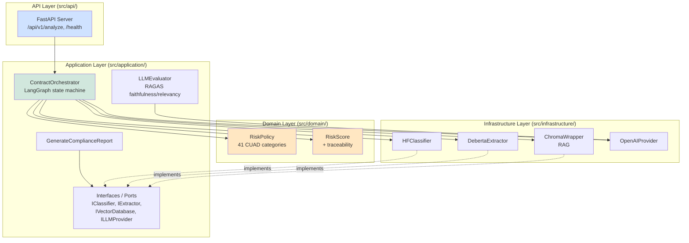
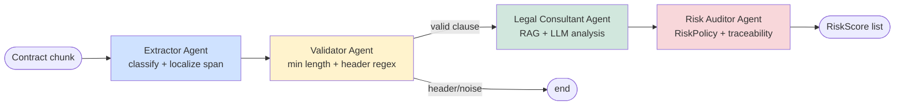
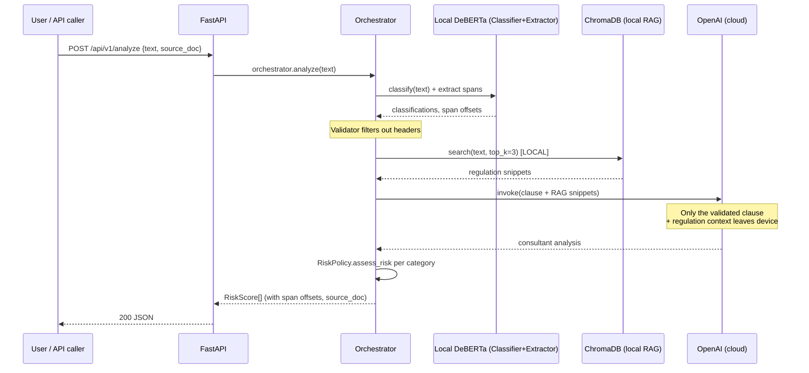
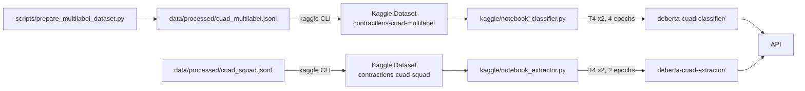
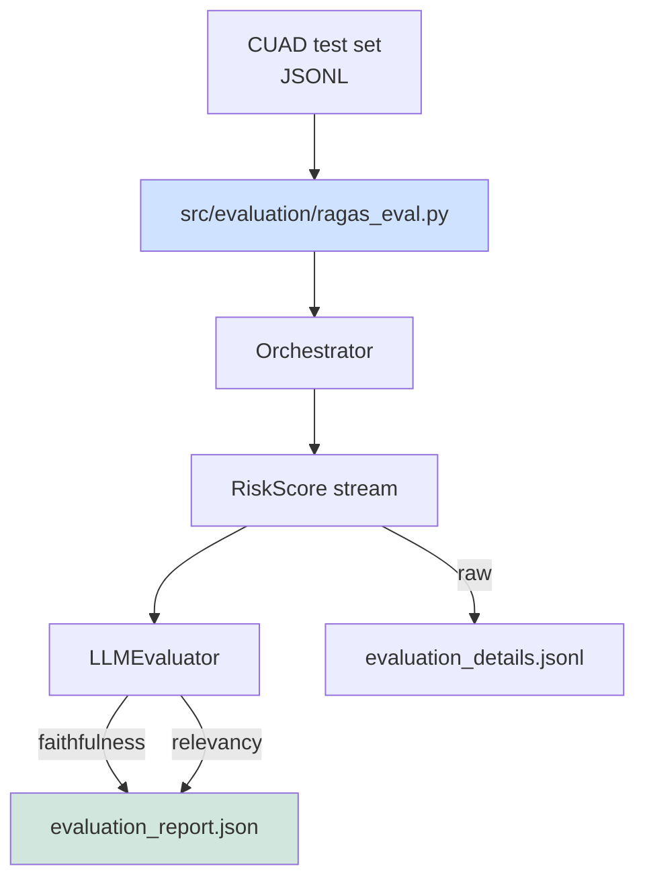

# ContractLens — Architecture

This document describes the runtime architecture of ContractLens and how the
four pipeline agents collaborate through the LangGraph state machine.

## High-level layering



## Agent pipeline

The orchestrator implements a four-node state machine. The Validator can
short-circuit the pipeline before any LLM call is made, which keeps cost
bounded for noisy inputs.



## Why each node exists

| Node | Spec mapping | Failure mode | Degraded behavior |
|------|--------------|--------------|-------------------|
| Extractor | Local DeBERTa for span extraction (privacy-first) | Extractor not loaded | Uses full chunk as span; offsets become None |
| Validator | Header/noise filter | Always succeeds; conservative thresholds | n/a |
| Consultant | OpenAI + RAG for reasoning | No API key / network failure | Rule-based justification only |
| Auditor | RiskPolicy + 41-category rules + traceability | Always succeeds | n/a |

## Privacy-first data flow



Key invariants:
- Raw contract bytes never leave the local machine.
- Only validated clauses (those passing the Validator) reach the cloud LLM.
- RAG corpus is embedded and searched entirely on-device.
- The full chunk content is sent to the LLM only when explicitly required
  for Consultant reasoning; if `DISABLE_LLM=1` is set, no cloud call is made.

## Configuration (env vars)

Set in `.env` or process environment. All have safe defaults.

| Variable | Default | Purpose |
|----------|---------|---------|
| `CLASSIFIER_MODEL` | `prajjwal1/bert-tiny` | HF identifier or local path for the classifier |
| `EXTRACTOR_MODEL` | `` (disabled) | Path or HF id for DeBERTa extractor; empty disables |
| `CHROMA_DIR` | `./chroma_db` | On-disk Chroma persistence path |
| `CHROMA_COLLECTION` | `legal_regulations` | Collection name |
| `OPENAI_API_KEY` | unset | If set, enables the Legal Consultant LLM call |
| `OPENAI_MODEL` | `gpt-4o` | Model used by Consultant |
| `DISABLE_LLM` | `false` | Force-disable LLM even if API key is present |
| `TESTING` | `false` | Skip orchestrator init at startup (used by tests) |

## Reproducible training (Kaggle)



To trigger production training:
1. `kaggle datasets create -p kaggle/datasets/cuad-multilabel`
2. Open a Kaggle Notebook with both datasets attached and GPU T4 x2
3. Paste `kaggle/notebook_classifier.py` (or `notebook_extractor.py`) as a cell
4. Run. The final cell saves to `/kaggle/working/<model_dir>` and writes
   `eval_report.json` with per-category F1.

## Evaluation flow



## File map

```
src/
├── api/
│   └── main.py                          # FastAPI + lifespan + orchestrator
├── application/
│   ├── generate_compliance_report.py    # JSON/PDF reporter use case
│   ├── evaluation/
│   │   └── evaluator.py                 # LLMEvaluator (RAGAS faithfulness)
│   ├── orchestration/
│   │   └── orchestrator.py              # LangGraph state machine (pipeline composition)
│   └── interfaces/                      # IClassifier, IExtractor, ILLMProvider, IVectorDatabase, IRiskAnalyzer
├── domain/
│   ├── contract.py                      # Contract aggregate + Clause + ContractMetadata
│   ├── risk_policy.py                   # 41 CUAD category policies
│   └── risk_score.py                    # RiskScore value object (traceability fields)
├── evaluation/
│   └── ragas_eval.py                    # batch eval harness
├── infrastructure/
│   ├── ai/
│   │   ├── hf_classifier.py             # HuggingFace classifier wrapper
│   │   ├── deberta_extractor.py         # DeBERTa QA extractor
│   │   ├── train_classifier.py          # Local fine-tuning
│   │   ├── train_extractor.py           # Local fine-tuning (QA)
│   │   └── kaggle_train_lora.py         # Kaggle entry point
│   ├── database/
│   │   └── chroma_wrapper.py            # ChromaDB RAG store
│   ├── llm/
│   │   └── openai_provider.py           # OpenAI Strategy implementation
│   └── reporting/
│       └── pdf_renderer.py              # reportlab-based PDF compliance report
└── data/
    ├── cuad_loader.py                   # CUAD JSON + CSV ingest
    ├── document_normalizer.py           # PDF/DOCX -> markdown
    └── sliding_window.py                # overlapping chunk tokenization

scripts/
├── analyze_cuad_structure.py
├── prepare_squad_dataset.py
├── prepare_multilabel_dataset.py        # SQuAD -> multi-label converter
├── push_to_kaggle.py
└── seed_regulations.py                  # populate ChromaDB with GDPR/AI Act

kaggle/
├── notebook_classifier.py               # standalone Kaggle script
├── notebook_extractor.py                # standalone Kaggle script
└── datasets/
    ├── cuad-multilabel/dataset-metadata.json
    └── cuad-squad/dataset-metadata.json
```
